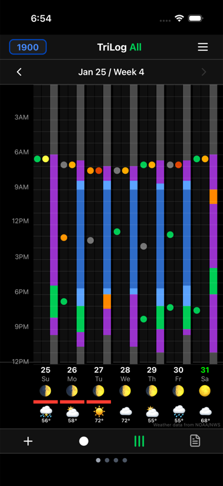

# TriLog

**Log what no sensor can see. Line it up with everything else.**

TriLog is a fast personal data logger for subjective experience — mood, energy, focus, symptoms, how your day actually felt. It also pulls in activities, notes, weather, pollen, Apple Health, and more, and puts it all on one dense visual grid: mood, energy, and activities mapped hour by hour, a whole week on one screen. Patterns that would take scrolling to notice elsewhere become obvious at a glance. There are no scores, streaks, or badges—just an honest record that grows more valuable over time.

The core experience — mood, energy, activity, notes, journal, daily routines — is **free forever**. No ads, no accounts, no tracking. Your data lives on your device and (if you choose) your private iCloud. TriLog Pro adds optional power-user features (Trackers, Apple Health metrics, Quick Track, Pomodoro, Siri voice logging) with a **30-day free trial**, then **$59.99/year** or **$7.99/month** — but never gates the core.

## Your Data Is Missing Something

You already track steps, sleep, screen time, and heart rate. But none of that tells you how you actually *felt*. And even when you do log mood or symptoms somewhere, it's rarely on the same timeline as the rest — scattered across Notes, a mood app, and your watch.

TriLog fills both gaps: three quick taps for subjective experience, then everything on one clock — inside data and outside context together — so you can compare and learn from what actually lines up.

**What gets measured gets managed.** And what gets *visualized* gets understood.

## What Makes TriLog Different

Most mood trackers show you one day at a time. You tap a rating, maybe write a note, and the day disappears into a list you'll rarely revisit.

TriLog takes a different approach. The main screen shows seven days of your life—168 hours—in a single view. Activities appear as colored blocks. Mood and energy show as small indicators. Weather, moon phases, pollen, and Apple Health metrics layer on the same grid.

This density is intentional. When subjective experience and external context share one timeline, patterns become visible that you'd never notice scrolling through individual entries or switching between apps. You might see that your mood dips every Wednesday afternoon, that exercise consistently precedes better evenings, or that barometric pressure lines up with headaches you've been logging.

## The Three Signals

TriLog tracks three complementary signals:

- **Mood**: Your emotional state (Happy, Neutral, Sad, Anxious, Upset)
- **Energy**: Your physical and mental vitality (1-5 scale)
- **Activity**: What you're doing (Sleep, Work, Exercise, Leisure, etc.)

These aren't meant to capture every nuance of human experience. They're broad categories that become meaningful through repetition and accumulation.

## Philosophy

TriLog is built on a few beliefs:

**Patterns matter more than precision.** Whether you rate your energy as 3 or 4 matters less than doing it consistently. Trends emerge from rough data just as well as from perfect data.

**Accumulation creates value.** A single day's entry tells you almost nothing. A week starts to show patterns. A month reveals rhythms. Several months can change how you understand yourself.

**Gaps are fine.** Life happens. You'll miss days, forget to log, lose interest for a while. The data you do collect remains valuable. TriLog doesn't punish inconsistency.

**Observation, not optimization.** TriLog shows you patterns. It doesn't tell you what they mean or what to do about them. You're the expert on your own life.

## Getting Started

When you first launch TriLog, a short onboarding walkthrough introduces the core concepts — what you'll track, why it matters, and how the visual grid works. After the walkthrough, a guided demo mode highlights key features with coach marks so you can explore at your own pace.

New to TriLog? Start with the [User Guide](guide/index.md).

## Guide Contents

- [Getting Started](guide/getting-started.md) — First steps with TriLog
- [Tracking Basics](guide/tracking-basics.md) — Mood, energy, and activities
- [The Visual Grid](guide/the-grid.md) — Understanding the main screen
- [Single Metric View](guide/single-metric-view.md) — Three weeks at a glance
- [Notes](guide/notes.md) — Adding context to your data
- [Day Launch & Day End](guide/day-routines.md) — Morning and evening routines
- [Viewing Patterns](guide/viewing-patterns.md) — Metrics, charts, and history
- [Habits](guide/habits.md) — Daily habit tracking
- [Settings](guide/settings.md) — Customization and backup
- [Pro Features](guide/pro-features.md) — Quick Track, Polling, Screen Time, Pomodoro, and more
- [Using TriLog Long-Term](guide/long-term.md) — Building a sustainable practice

## Links

- [Download on the App Store](https://apps.apple.com/app/trilog/id6754526159)
- [Website](https://trilog.app)
- [Support](https://trilog.app/support.html)
- [Privacy Policy](https://trilog.app/privacy.html)
