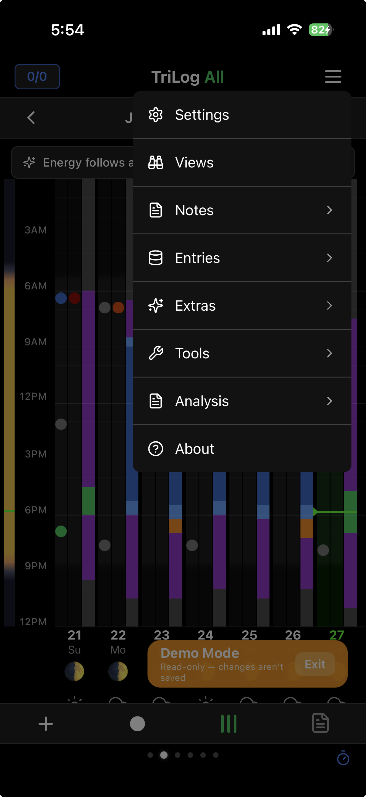
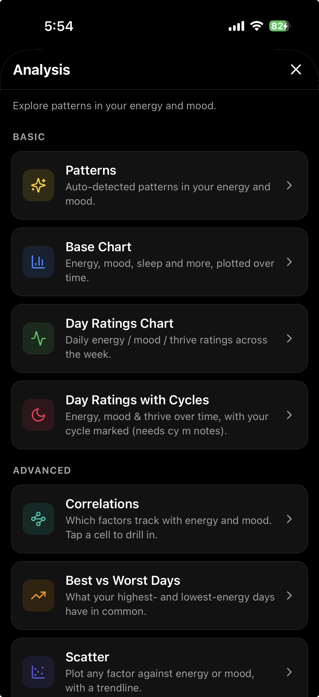
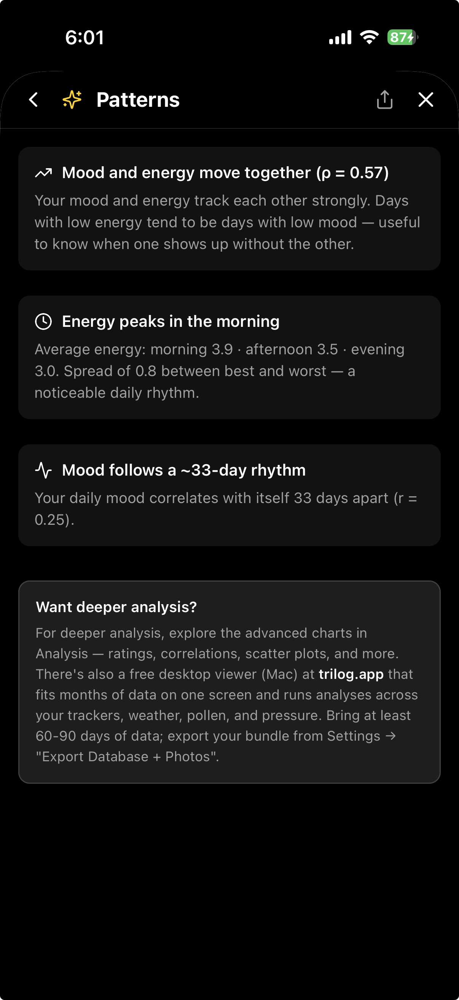
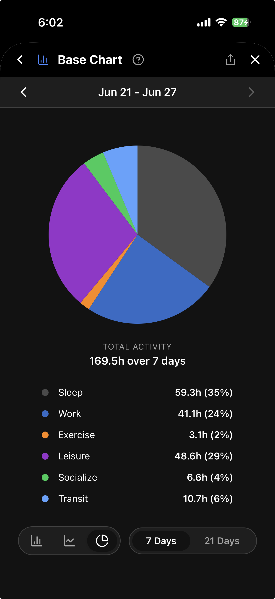
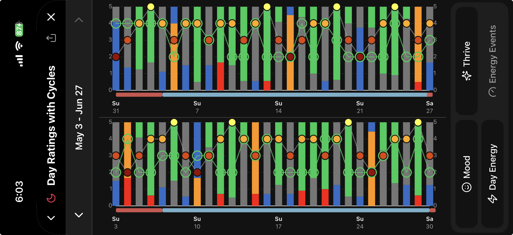
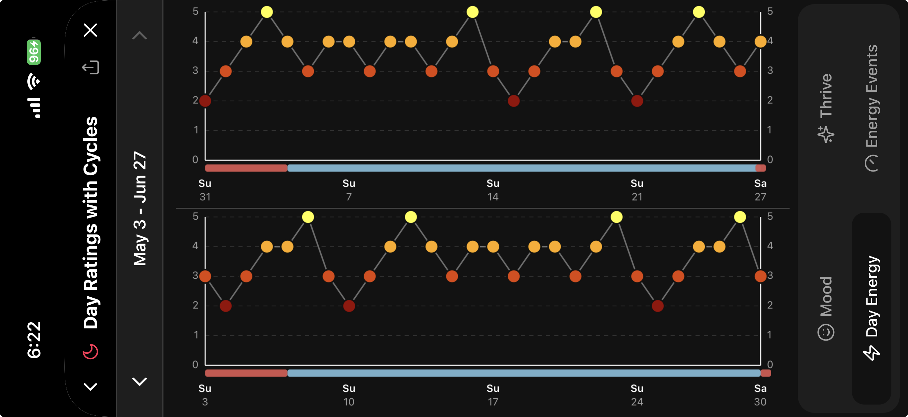

# Analysis

Charts, auto-detected patterns, and analytical reports live in **Menu → Analysis** (lines icon in the top-right, then **Analysis**). This replaced the old swipeable Charts and Ratings views — they are no longer horizontal swipe pages.

The launcher lists reports as cards under **Basic** (free) and **Advanced** (Pro). Tap a card to open it; use the back arrow to return to the launcher.

---

## Patterns (Basic, free)

Auto-detected findings from your mood and energy history — weekly rhythms, time-of-day energy dips, mood/energy coupling, and similar. Surfaces after you have enough data; each finding is a card with a plain-language explanation.

---

## Base Chart (Basic, free)

Activity distribution and trends over time — stacked bar chart, mood/energy lines, and a **pie chart** showing how your hours actually divided across activities.

Toggle between bar and pie modes. Switch between **7-day** and **21-day** windows (or navigate by week).

---

## Day Ratings Chart (Basic, free)

Your daily subjective ratings — Mood, Energy, Thrive, and a calculated **Energy Events** score — as two side-by-side line charts, each covering four weeks (28 days, Sunday to Saturday).

**Four toggles** (two rows at the bottom):

**Row 1:**
- **Mood** — Stacked vertical bars per day, proportional to your mood distribution (upset, anxious, sad, neutral, happy).
- **Thrive** — Your daily "on" rating (1–5) — how present or aligned you felt. Open green rings connected by a green line.

**Row 2:**
- **Day Energy** — The 1–5 energy rating from your daily summary. Colored dots connected by a gray line.
- **Energy Events** — A calculated weighted energy score combining individual energy entries with sleep activity throughout the day (sleep hours = 0; waking hours use last observation carried forward).

Tap a day for a tooltip with Energy, Thrive, and Energy Events. **View Notes** jumps to that day's notes. Use the arrows at the top to move back and forward by four weeks.

  

The Energy Events score is also available as a row in the Metrics Grid (off by default). Enable it in the grid wrench → Measurements.

---

## Day Ratings with Cycles (Basic, free)

The same Day Ratings chart with your **menstrual cycle** overlaid as colored bands (requires cycle tracking — log with `cy m` / `cy -m` prefixes or Menu → Extras → Cycles). Useful for spotting energy and mood shifts across your cycle.

  

Toggle which ratings appear — e.g. show just **Day Energy** against cycle bands to isolate one signal.

---

## Advanced reports (Pro)

The **Advanced** section unlocks with Pro (or Demo Mode). Locked cards show a PRO badge and route to Upgrade.

- **Correlations** — which factors track with energy and mood (tap a cell to drill into Scatter)
- **Best vs Worst Days** — what your highest- and lowest-energy days have in common
- **Scatter** — plot any factor against energy or mood with a trendline
- **Energy by Category** — average energy by workouts, alcohol, day of week, trackers, and more

More screenshots for these reports are coming. Each card shows a readiness hint ("Needs more days", "Needs a cy m note") when there isn't enough data yet.

---

## Share and help

Reports opened from Analysis include **Share** (export image) and **Help** (ⓘ) where applicable.

---

[← Back to Guide](index.md) · [Viewing Patterns](viewing-patterns.md) · [Pro Features](pro-features.md)
