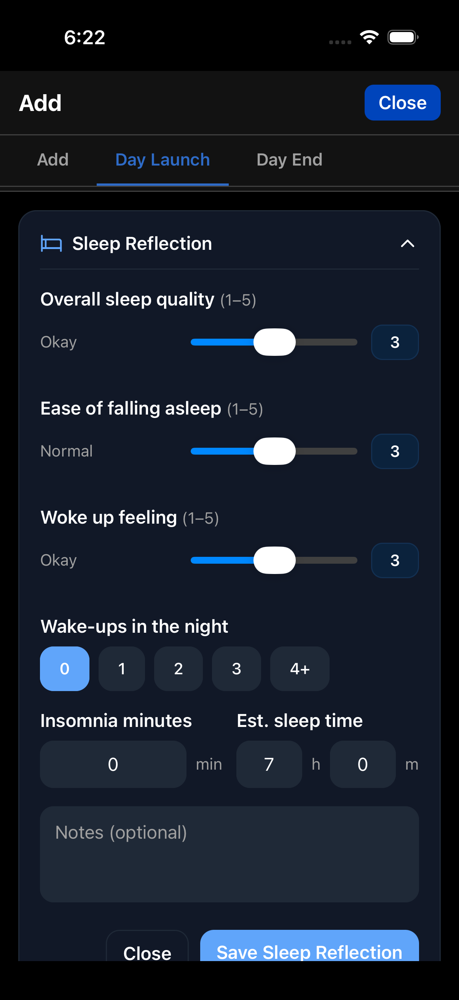
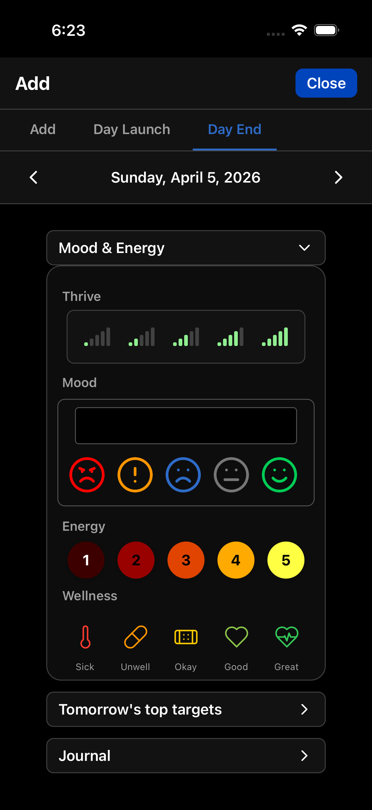
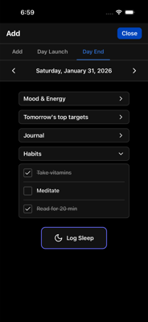

# Day Launch & Day End

For those who want structured daily reflection, TriLog offers Day Launch and Day End screens. These are optional—you can use TriLog perfectly well without them.

## Day Launch

Day Launch is for mornings. It captures how you slept and sets up your day.

Access it from the Add Entry modal by tapping the "Day Launch" tab.

### Sleep Tracking

Day Launch captures detailed sleep information:

- **Sleep Quality** — How well did you sleep? (0-5 scale)
- **Sleep Onset** — How easily did you fall asleep? (0-5 scale)
- **Waking Feeling** — How did you feel upon waking? (0-5 scale)
- **Wake-ups** — How many times did you wake during the night?
- **Sleep Duration** — Total hours and minutes of sleep
- **Insomnia** — Time spent awake trying to sleep

This creates a sleep record you can correlate with your day's mood and energy. Over time, you'll see how sleep affects how you feel.

### Yesterday's Goals

Day Launch shows the goals you set the previous evening. This creates accountability—you see what you intended to do.

### Morning Routine (Pro)

Pro users can set up a morning routine checklist. Common items:
- Make bed
- Meditate
- Exercise
- Review calendar

The routine uses markdown formatting, so you can customize it however you like.

---

## Day End

Day End is for evenings. It prompts reflection on your day and planning for tomorrow.

Access it from the Add Entry modal by tapping the "Day End" tab.

### Tomorrow's Top Targets

Set up to three intentions for the next day:

- Task 1: Most important thing to accomplish
- Task 2: Secondary priority
- Task 3: Nice to have

These appear in the next morning's Day Launch, creating a feedback loop between planning and doing.

### Journal

Space for longer reflection. What happened today? What's on your mind? What do you want to remember?

This is optional. Many people skip it entirely. Others find it valuable for processing the day.

### Habits

If you've set up daily habits, Day End shows them as checkboxes. Check off what you completed.

### Wellness Check

Day End can include wellness assessments—simple ratings of how various aspects of life are going. Configure these in Settings.

### Resting Heart Rate (Pro, iOS)

If you have an Apple Watch or compatible device, Day End can display your resting heart rate. This metric often correlates with recovery, stress, and overall health.

Enable in Settings → Appearance → Resting Heart Rate.

---

## Using Day Launch & Day End

### The Full Routine

Some people use both every day:

**Morning (Day Launch)**
1. Record last night's sleep
2. Review yesterday's goals
3. Complete morning routine checklist

**Evening (Day End)**
1. Set tomorrow's goals
2. Write a brief journal entry
3. Check off completed habits
4. Note anything significant

### The Minimal Approach

Others use just pieces:

- Sleep tracking in the morning only
- Goal setting in the evening only
- Habits without the journal

Use what helps. Skip what doesn't.

### When to Use Them

Day Launch works best shortly after waking—sleep details are fresh.

Day End works best before bed—the day is complete, tomorrow can be planned.

But timing is flexible. A lunch-time Day Launch still captures useful sleep data. A morning Day End can reflect on yesterday.

---

[← Back to Guide](index.md) · [Next: Viewing Patterns →](viewing-patterns.md)
