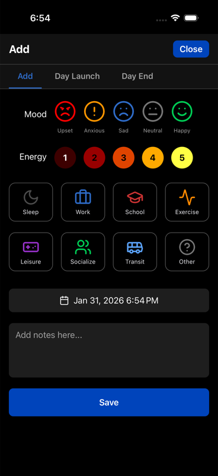
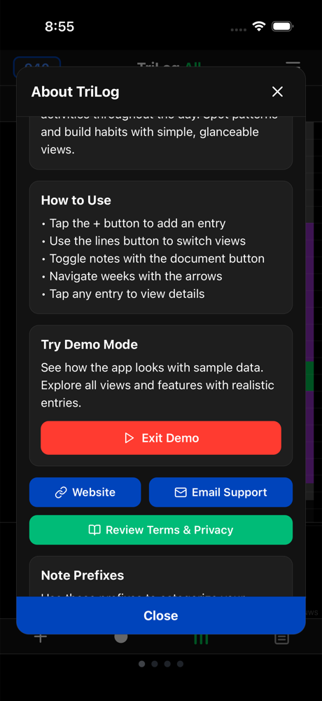

# Getting Started

TriLog takes under a minute to learn. Here's what you need to know.

## Your First Entry

1. **Tap the + button** at the bottom of the screen
2. **Select your mood** — how are you feeling right now?
3. **Select your energy** — how's your vitality?
4. **Select your activity** — what are you doing?
5. **Tap Save**

That's it. You've logged your first entry.

## The Main Screen

The main screen shows your week as a visual grid:

- **Each column** is a day (Sunday through Saturday)
- **Each row** is an hour (24 hours from midnight to midnight)
- **Colored blocks** show your activities
- **Small indicators** show mood and energy

Swipe left and right to navigate between weeks.

## Finding Your Rhythm

There's no right way to use TriLog. Some approaches that work:

**Log throughout the day.** When your mood or activity changes, take five seconds to record it. This creates the most detailed picture.

**Log once at day's end.** Before bed, backfill the day's major activities and your overall mood. Less detailed but easier to maintain.

**Log when you remember.** Sporadic logging still captures something. Gaps are fine.

Most people settle into a pattern within a week. Don't force it—whatever you'll actually do consistently is the right approach.

## Demo Mode

New to TriLog? Try Demo Mode to see the app with sample data. Access it from Settings → Demo Mode.

Demo Mode shows what a week of tracking looks like, with pre-populated entries across all features.

## What's Next

- Learn about [Tracking Basics](tracking-basics.md) — mood, energy, and activities in detail
- Understand [The Visual Grid](the-grid.md) — reading your week at a glance
- Explore [Notes](notes.md) — adding context to your entries

---

[← Back to Guide](index.md)
