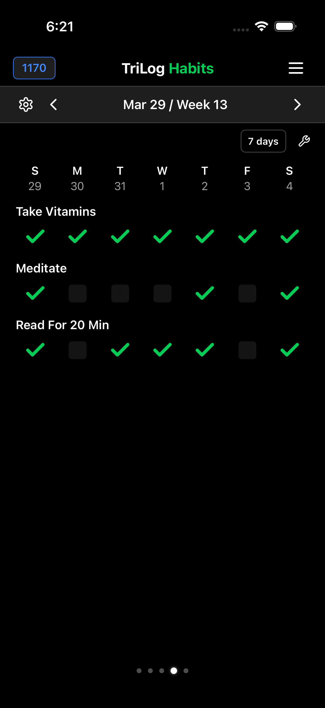

# Habits

Habits are daily recurring tasks you want to track. Unlike one-time todos, habits repeat every day.

## Setting Up Habits

Access Habits from Menu → Extras → Habits.

### Creating a Habit

1. Tap "Add Habit"
2. Enter the habit name (e.g., "Morning meditation")
3. Save

The habit now appears in your daily checklist.

### Example Habits

Common habits people track:

- Morning meditation
- Drink 8 glasses of water
- Read for 20 minutes
- Exercise
- Take vitamins
- Journal
- No screens after 9pm
- Make bed

Keep the list manageable. Five focused habits are better than twenty aspirational ones.

## Completing Habits

Check off habits in two places:

### Day End Screen

The Day End tab shows your habits as checkboxes. Check off what you completed before bed.

### Habits Grid View

Swipe to the Habits view to see a weekly grid of all habits. Each row is a habit. Each column is a day. Tap to toggle completion.

This view shows your consistency at a glance.

## Viewing Consistency

The Habits grid reveals patterns:

- **Solid rows** indicate consistent habits
- **Sparse rows** show habits that aren't sticking
- **Weekday/weekend differences** become obvious

Over time, you'll see which habits you maintain and which need attention.

## Tips for Habit Tracking

**Start with one habit.** Add more once that one is established.

**Be specific.** "Exercise" is vague. "30 minutes of walking" is clear.

**Track what you'll actually do.** Aspirational habits you consistently miss are demoralizing. Track what's achievable.

**Expect inconsistency.** Nobody maintains 100% streaks. Gaps happen. What matters is the long-term trend.

**Review weekly.** At the end of each week, look at your habit grid. Celebrate consistency. Notice patterns.

## Habits vs. Activities

Habits and activities serve different purposes:

**Activities** record what you're doing throughout the day. They fill time blocks on the chart.

**Habits** are yes/no daily tasks. They don't have duration—just completion.

Use activities for time tracking. Use habits for behavior tracking.

---

[← Back to Guide](index.md) · [Next: Settings →](settings.md)
