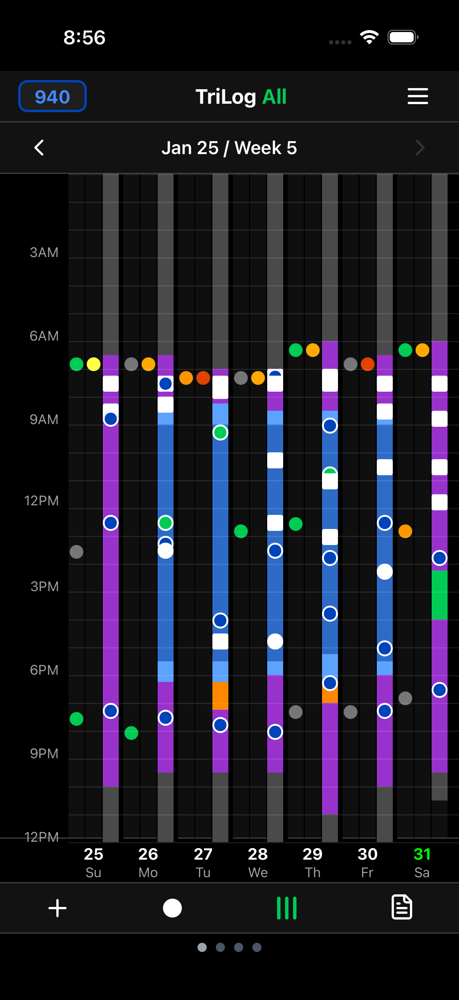
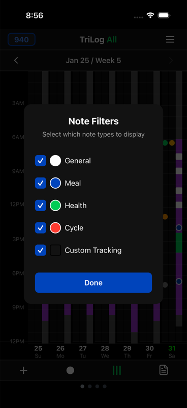

# Notes

Notes add context to your data. A mood entry tells you *how* you felt; a note tells you *why*.

## Adding Notes

When logging an entry, tap the note field to add text. Short phrases work best:

- "Bad sleep last night"
- "Argument with coworker"
- "Great workout"
- "Coffee with Sarah"

You're writing for your future self, not composing a journal. Brief is better than detailed.

## Why Notes Matter

Notes become powerful through repetition. After a few months, you might notice:

- "Bad sleep" appears before many low-energy days
- "Coffee with Sarah" correlates with better moods
- "Deadline stress" clusters with anxiety entries

These patterns aren't visible in a single entry. They emerge from accumulation.

## Viewing Notes

Tap the notes icon on the main screen to see all your notes in a list.

Each note shows:
- The text you wrote
- The timestamp
- Associated mood, energy, and activity

Scroll through to review your history, or use search to find specific entries.

## Note Types

Notes can be categorized by prefix:

### General Notes (default)
Just write your note. No prefix needed.

### Meal Notes
Start with **m** followed by the meal and optional calories:
- `m breakfast`
- `m lunch 450`
- `m snack apple 80`

Meal notes appear in a separate meal list and contribute to daily calorie totals (if you've enabled calorie tracking in Settings).

### Health Notes
Start with **h** for health-related observations:
- `h headache`
- `h took ibuprofen`
- `h doctor appointment`

### Cycle Notes
Start with **cy** for menstrual cycle tracking:
- `cy started`
- `cy day 14`
- `cy cramps`

## Filtering Notes

Long-press the notes icon to access filters. You can show/hide different note types:

This helps when you want to review just meals, or just health notes, without other entries cluttering the view.

## Shorthand

If you log the same things repeatedly, shorthand saves typing.

Define abbreviations that expand automatically:
- `bf` → "breakfast with coffee"
- `gym` → "Gym - upper body workout"
- `med` → "Took morning medication"

Access shorthand settings through Menu → Extras → Shorthand.

### Creating Shortcuts

1. Open Menu → Extras → Shorthand
2. Tap "Add Shortcut"
3. Enter the abbreviation (key)
4. Enter the full text it should expand to
5. Save

When you type the abbreviation in a note, it expands automatically.

## Search

The notes list includes search. Type any word to find matching entries.

Useful for:
- Finding all mentions of a person
- Reviewing entries about a specific topic
- Locating notes from a particular event

---

[← Single Metric View](single-metric-view.md) · [Back to Guide](index.md) · [Next: Day Launch & Day End →](day-routines.md)
