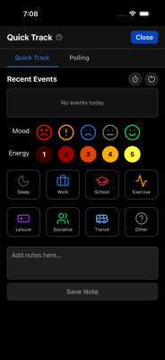
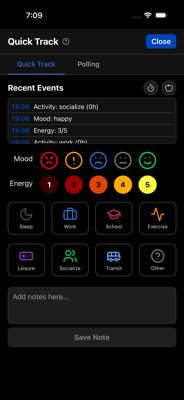
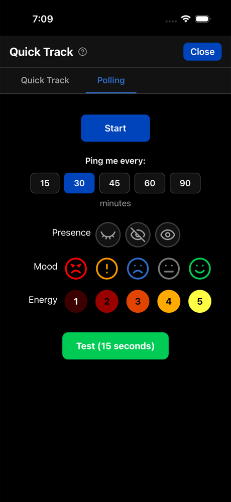
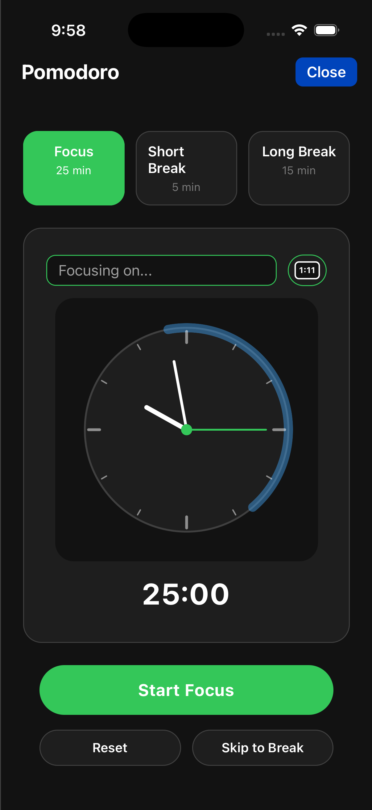

# Pro Features

TriLog is fully functional without paying anything. Pro exists for users who want additional features and who want to support ongoing development.

## Quick Track

Quick Track provides rapid entry logging without opening the full add modal.



### How It Works

1. Open Quick Track from the Menu
2. Tap your current mood
3. Tap your current energy
4. Optionally select an activity
5. Done—entry logged

The whole process takes seconds. No modal to dismiss, no timestamp to adjust.

### When to Use Quick Track

Quick Track shines when you want frequent data points without friction:

- Responding to a Polling notification
- Logging quickly during a busy day
- Capturing mood shifts as they happen



---

## Polling

Polling sends periodic notifications asking how you're doing.



### How It Works

1. Enable Polling in Menu → Extras → Polling
2. Set your preferred interval (e.g., every 2 hours)
3. Receive gentle notifications throughout the day
4. Tap to open Quick Track and log your state

### Why Polling Helps

Without reminders, most people log sporadically. Polling creates regular data points—a more complete picture of your day.

The notifications are gentle. Ignore them if you're busy. Respond when you can.

### Configuration

- **Interval** — How often to send notifications
- **Start/End Time** — When polling is active (e.g., 8am-10pm)
- **Test** — Send a test notification immediately

---

## Pomodoro Timer

A classic 25-minute focus timer integrated with your tracking.



### The Technique

The Pomodoro Technique uses timed work intervals:

1. **Focus** — 25 minutes of concentrated work
2. **Short Break** — 5 minutes of rest
3. **Repeat** — After 4 focus sessions, take a long break (15 minutes)

### Features

- **Three modes** — Focus, Short Break, Long Break
- **Customizable sounds** — Different sounds for session start/end
- **Keep Screen On** — Optional setting to prevent screen sleep
- **Analog or Digital** — Choose your preferred clock display
- **Session History** — Track completed sessions
- **Daily Count** — See how many pomodoros you've completed today

### Focus Text

Optionally set a focus intention before starting. What will you work on? This gets logged with the session.

### Integration

Completed Pomodoro sessions integrate with your TriLog data. See how focused work correlates with mood and energy.

---

## Custom Trackers

Track anything not covered by the default options.

### Creating a Tracker

1. Open Menu → Extras → Trackers
2. Tap "Add Tracker"
3. Enter a key (internal name) and label (display name)
4. Choose a type
5. Save

### Tracker Types

**Text** — Records presence/absence. Any entry with this key shows a blue square.

**Count** — Counts occurrences. Multiple entries with this key show the total count.

**Sum** — Sums numbers. Entries like "water 3" and "water 2" show "5".

**Traffic Light** — Shows status as color. Enter 1-5; displays as red (1) through green (5).

### Example Trackers

- **Water intake** (Sum) — Track glasses of water
- **Medication** (Text) — Did you take it today?
- **Pain level** (Traffic Light) — Quick status indicator
- **Coffee** (Count) — How many cups?

### Viewing Trackers

Custom trackers appear in the Metrics grid and have their own Trackers grid view.

---

## Morning Routine (Pro)

A customizable checklist for your morning routine, displayed in Day Launch.

### Setup

1. Open Day Launch
2. Tap "Edit Routine"
3. Enter your routine using markdown checkboxes:

```
- [ ] Make bed
- [ ] Meditate 10 minutes
- [ ] Exercise
- [ ] Review calendar
```

### Usage

Each morning, check off completed items. The routine resets daily.

---

## Resting Heart Rate (iOS)

If you have an Apple Watch or compatible device, TriLog can display your resting heart rate.

### Why It Matters

Resting heart rate often indicates:
- Recovery status
- Stress levels
- Overall cardiovascular health
- Illness (elevated RHR can signal coming sickness)

### Setup

1. Ensure your device is recording RHR to Apple Health
2. Enable in Settings → Appearance → Resting Heart Rate
3. View in Day End and Metrics grid

---

## About Pro

Pro is a subscription that supports TriLog's development. The free version is complete and will remain so.

If TriLog becomes something you rely on, Pro ensures it stays available and keeps improving.

---

[← Back to Guide](index.md) · [Next: Using TriLog Long-Term →](long-term.md)
