# Pro Features

TriLog is fully functional without paying anything. Pro exists for users who want additional features and who want to support ongoing development.

## Quick Track

Quick Track provides rapid entry logging without opening the full add modal.

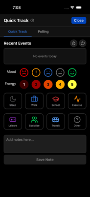

### How It Works

1. Open Quick Track from the Menu
2. Tap your current mood
3. Tap your current energy
4. Optionally select an activity
5. Done—entry logged

The whole process takes seconds. No modal to dismiss, no timestamp to adjust.

### When to Use Quick Track

Quick Track shines when you want frequent data points without friction:

- Responding to a Polling notification
- Logging quickly during a busy day
- Capturing mood shifts as they happen

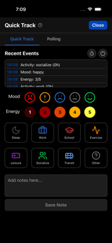

---

## Polling

Polling sends periodic notifications asking how you're doing.

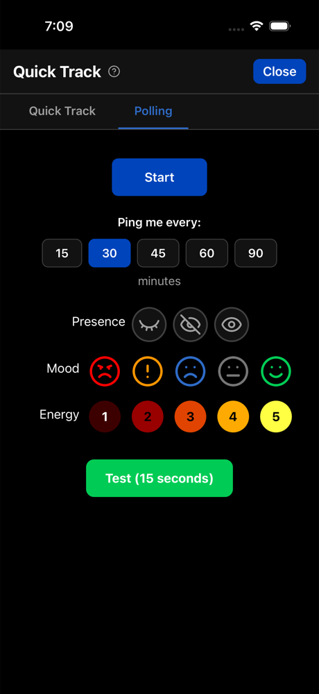

### How It Works

1. Enable Polling in Menu → Extras → Polling
2. Set your preferred interval (e.g., every 2 hours)
3. Receive gentle notifications throughout the day
4. Tap to open Quick Track and log your state

### Why Polling Helps

Without reminders, most people log sporadically. Polling creates regular data points—a more complete picture of your day.

The notifications are gentle. Ignore them if you're busy. Respond when you can.

### Configuration

- **Interval** — How often to send notifications
- **Start/End Time** — When polling is active (e.g., 8am-10pm)
- **Test** — Send a test notification immediately

---

## Pomodoro Timer

A classic 25-minute focus timer integrated with your tracking.

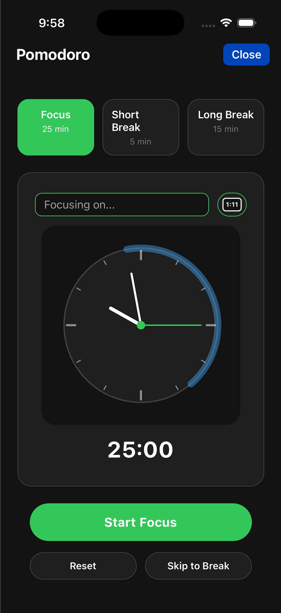

### The Technique

The Pomodoro Technique uses timed work intervals:

1. **Focus** — 25 minutes of concentrated work
2. **Short Break** — 5 minutes of rest
3. **Repeat** — After 4 focus sessions, take a long break (15 minutes)

### Features

- **Three modes** — Focus, Short Break, Long Break
- **Customizable sounds** — Different sounds for session start/end
- **Keep Screen On** — Optional setting to prevent screen sleep
- **Analog or Digital** — Choose your preferred clock display
- **Session History** — Track completed sessions
- **Daily Count** — See how many pomodoros you've completed today

### Focus Text

Optionally set a focus intention before starting. What will you work on? This gets logged with the session.

### Integration

Completed Pomodoro sessions integrate with your TriLog data. See how focused work correlates with mood and energy.

---

## Screen Time

Screen Time shows your app usage alongside mood, energy, and activities on a single chart. This makes it easy to spot how device usage relates to how you feel.

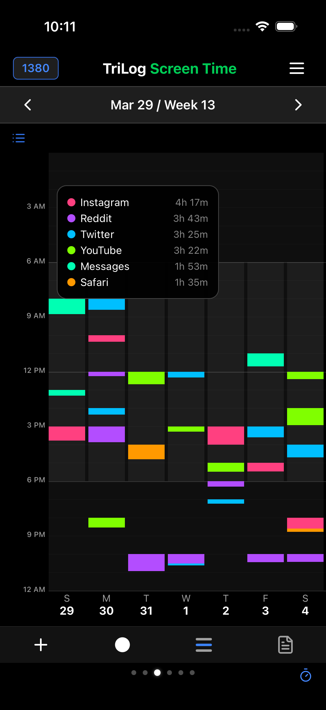

### Display Modes

Screen Time offers multiple display modes so you can compare patterns from different angles:

**Mood & Energy** — Overlay screen time with your mood and energy trends to see correlations.

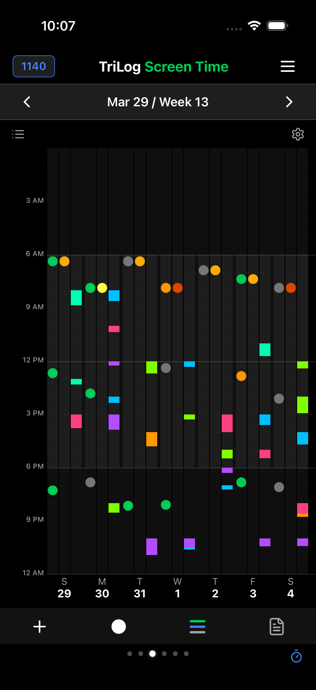

**Activity** — See screen time alongside your activity data to understand how device usage fits into your day.

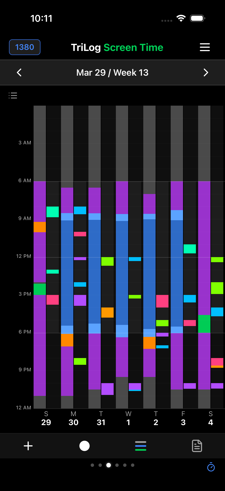

### What You Might Notice

- High screen time in the evening correlating with worse sleep quality
- Social media spikes during low-energy periods
- Reduced device usage on days with more exercise or social time

Screen Time doesn't judge — it just puts the data side by side so patterns become visible.

---

## Analysis (Advanced, Pro)

**Menu → Analysis** opens a launcher of reports. **Basic** reports (Patterns, Base Chart, Day Ratings, Day Ratings with Cycles) are free. **Advanced** reports require Pro:

- **Correlations** — which factors track with energy and mood
- **Best vs Worst Days** — what high- and low-energy days have in common
- **Scatter** — plot any factor against energy or mood
- **Energy by Category** — average energy by workouts, alcohol, day of week, trackers, and more

See [Analysis](analysis.md) for screenshots and details.

---

## Day View with Sun Clock

Day View shows today's entries alongside an astronomical sun clock visualization. The sun clock displays sunrise, sunset, and the current position of the sun, giving your daily data a natural time context.

This is a Pro feature that adds a different perspective to your day — your logged entries mapped against the rhythm of daylight.

---

## Scheduling

Set reminders at specific times of day to check in. Access Scheduling from Menu → Extras (···).

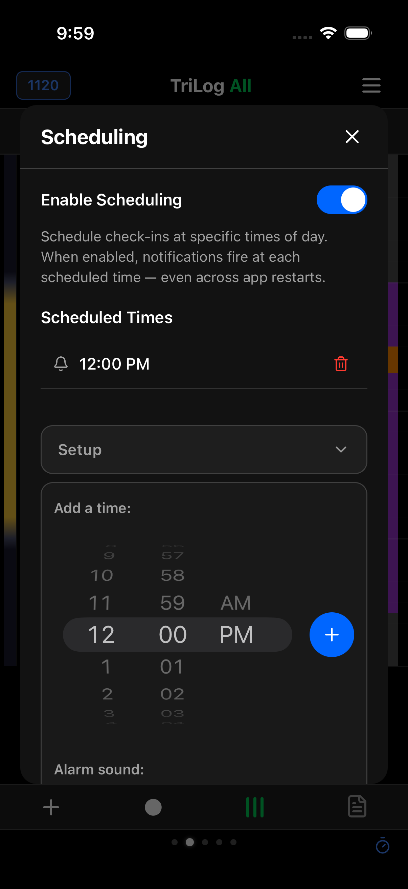

Pick the times that match your routine — morning, midday, evening — and TriLog will send a notification prompting you to log. This pairs well with Quick Track for fast responses to reminders.

---

## Siri Input

Log entries hands-free using Siri. Say something like "Log my mood in TriLog" to create an entry without opening the app. Useful when you're on the go or want minimal friction.

---

## Trackers

Track anything beyond mood and energy — symptoms, supplements, medications, ratings, habits. The point is finding correlations: *"did my energy drop on the days I forgot magnesium?"*

There are two kinds of trackers, designed for different rhythms:

### Day Trackers

One entry per day, edited from the Day-End view. Use for things you assess once a day at the end of it: daily mood, sleep quality, pain level, whether you took your meds.

**Day tracker types:**

- **Text** — A single end-of-day note. Grid shows a blue square for any day with a note.
- **Rating** — A 0–5 rating. Grid shows the number.
- **Traffic Light** — A 1–5 status shown as a colored square (red → green).
- **Itemized List** — Define a fixed list (e.g., "morning supplement stack"); mark each day yes/no for completion.
- **Toggle** — Stateful on/off flag. Stays on until you flip it off — perfect for "on antibiotics" or "on vacation."

### Event Trackers

Logged many times a day, each timestamped. Use for things that happen at moments: caffeine doses, headache flares, brain-fog ratings.

The grid always shows a number per day:
- **Sum** → adds the values you logged
- **Average** → averages them
- Every other type → counts the entries

**Event tracker types:**

- **Text** — A free-form note. Grid shows the count.
- **Number** — Each entry is a number. Pick **Sum** (cumulative — caffeine mg, water oz) or **Average** (snapshot ratings averaged).
- **Rating** — A 0–5 rating logged through the day. Grid shows the count. Log a 0 to mark "resolved" — e.g., a headache going away.
- **Traffic Light** — A 1–5 rating shorthand. Grid shows the count.
- **Itemized List** — A fixed list (e.g., a morning supplement stack). Each entry = "took the whole list."

### Three Ways to Log

1. **Type a note.** Start any journal note with `t key value note` (e.g., `t caf 100 espresso`). Works from Siri voice entries too.
2. **Use the Tracker tab** on the Add (+) dialog — pick a tracker from the list and fill in the type-specific input. No key to remember. Enable in Settings → Appearance → "Tracker Input on Add."
3. **From the grid.** Tap any cell in the Trackers grid to view, edit, or add entries for that day.

### Creating a Tracker

1. Open Menu → Extras → Trackers
2. Tap the **+** button
3. Pick **Day** or **Event** tracker
4. Enter a label (display name)
5. Pick a category (general, symptom, event, medicine, supplement) and a type
6. Save

For event trackers, you'll also pick a short key (e.g., `caf` for caffeine) used in the freeform text format. Day trackers don't need a key — they're never logged as notes.

### Viewing Trackers

The dedicated Trackers grid (enable in Settings → Appearance → Trackers View) shows every tracker across days side-by-side. Day Trackers appear on top, Event Trackers below. Toggle between 7- and 21-day views with the toolbar button. Tap any cell to view, edit, or add entries.

### Example Setups

- **Headaches (day, Traffic Light)** + **Headaches (event, Rating)** — daily summary plus per-occurrence severity. Log a 0 when the headache resolves.
- **Caffeine mg (event, Number → Sum)** — `t caf 100`, `t caf 50` — grid shows the day's total.
- **Morning Stack (day, Itemized List)** — list out your vitamins/supplements once; mark each day yes/no for taking them.
- **On Antibiotics (day, Toggle)** — flip on at start of course, off at the end; grid carries the state forward across days.

---

## Intake

Log what you consume with structured amounts — coffee, tea, water, vitamins, medications, alcohol, and more. Intake events are timestamped and stored separately from notes, so you get a clean daily list you can compare with mood and energy.

**Enable:** Settings → Appearance → **Intake Tab on Add** (Pro).

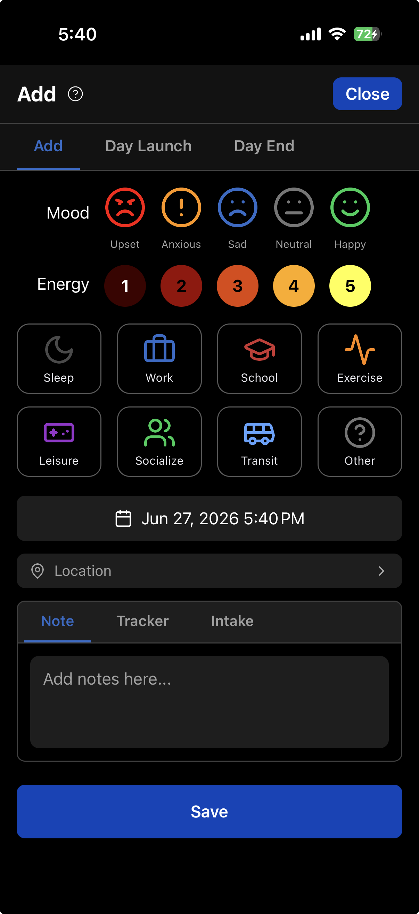

### Intake Library

Define your catalog once in **Menu → Extras → Intake Library**. Items can be **single** (name + default amount + unit) or **list** (a supplement stack you take as one checkmark). Grouped by category: Caffeine, Vitamins/Supplements, Medication, Alcohol, Other.

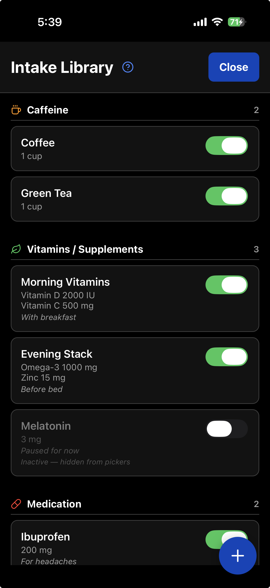

### Logging

- **Add (+) dialog → Intake tab** — pick an item, set quantity, tap **Add Intake** (saves immediately; add multiple items without closing the dialog).
- **Day End → Day Intake** — quick log and review alongside Day Trackers.

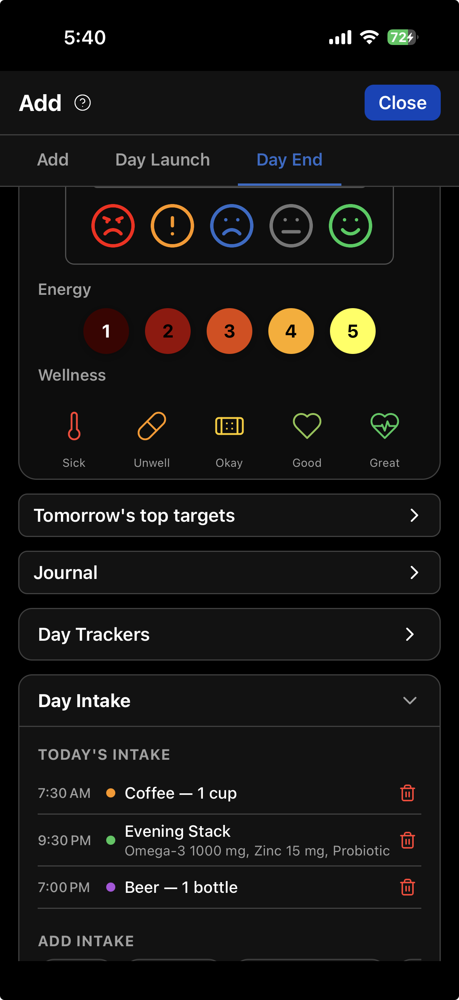

### Review

**Menu → Entries → Intake** — all intake events grouped by day.

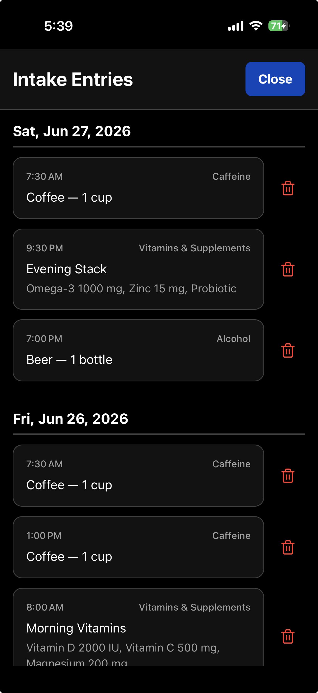

See [Intake](intake.md) for the full guide (item types, defaults, intake vs trackers).

---

## Morning Routine (Pro)

A customizable checklist for your morning routine, displayed in Day Launch.

### Setup

1. Open Day Launch
2. Tap "Edit Routine"
3. Enter your routine using markdown checkboxes:

```
- [ ] Make bed
- [ ] Meditate 10 minutes
- [ ] Exercise
- [ ] Review calendar
```

### Usage

Each morning, check off completed items. The routine resets daily.

---

## Resting Heart Rate (iOS)

If you have an Apple Watch or compatible device, TriLog can display your resting heart rate.

### Why It Matters

Resting heart rate often indicates:
- Recovery status
- Stress levels
- Overall cardiovascular health
- Illness (elevated RHR can signal coming sickness)

### Setup

1. Ensure your device is recording RHR to Apple Health
2. Enable in Settings → Appearance → Resting Heart Rate
3. View in Day End and Metrics grid

---

## Pro Setup

After you subscribe or restore Pro, TriLog opens a skippable setup wizard once. Reopen it anytime from **Menu → Extras → Pro Setup**.

### Steps

1. **Intro** — overview of Pro features
2. **Trackers** — pick optional templates or skip:
   - Headache (day rating)
   - Focus (day rating)
   - Sleep quality (day rating)
   - Caffeine (event count)
   - Medication taken (day checkbox)
   - Energy crash (day traffic light)
3. **Quick Track** — one-tap logging from the bottom bar and optional Polling
4. **Views** — turn on Trackers View, Day Screen, and Screen Time View
5. **More tools** — Intake, Pomodoro, Siri Shortcuts, Customize, Workouts, and related Pro tools
6. **Done**

Each step has an expandable **Learn more** section. Skip any step or the whole wizard — configure everything later in Settings and the menu.

---

## About Pro

Pro is a subscription that supports TriLog's development. The free version is complete and will remain so.

**Pricing:** **$59.99/year** or **$7.99/month**, each with a **30-day free trial** for new subscribers. The Upgrade screen (Menu → Upgrade to Pro, or Settings → Account) shows the trial and renewal price before you confirm. Cancel anytime in iOS Settings → Apple ID → Subscriptions.

**Demo Mode** (About → Try Demo) lets you preview Pro with sample data without starting a subscription.

If TriLog becomes something you rely on, Pro ensures it stays available and keeps improving.

---

[← Back to Guide](index.md) · [Next: Using TriLog Long-Term →](long-term.md)
