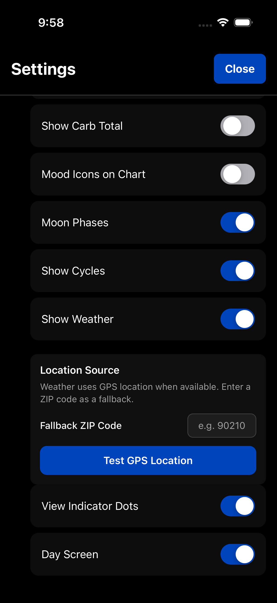

# Settings

TriLog offers extensive customization. Access Settings through the Menu.

## Appearance

Control how TriLog looks and what information displays.

### Display Options

- **Cycles** — Show menstrual cycle tracking indicators on the chart
- **Weather** — Display weather strip below the chart
- **Moon Phases** — Show lunar phase indicators
- **Steps Count** — Display daily steps in the header
- **Calorie Count** — Show daily calorie total in the header
- **Mood Icons** — Display mood emoji on the chart
- **View Indicator Dots** — Show navigation dots between views

### View Toggles

- **Trackers View** — Show/hide the Trackers grid (Pro)
- **Habits View** — Show/hide the Habits grid

Toggle off views you don't use to simplify navigation.

### Resting Heart Rate (Pro, iOS)

If you have an Apple Watch, enable this to display resting heart rate in Day End and the Metrics grid.

## Theme

TriLog supports light and dark modes.

By default, the app follows your system preference. You can also set it manually:

- **Light** — White background, for daytime use
- **Dark** — Dark background, easier on eyes at night
- **System** — Follows your device setting

## Backup

Your data is stored locally on your device. Backup ensures you don't lose it.

### iCloud Backup (iOS)

Enable iCloud backup to automatically sync your data to Apple's cloud. This also syncs between devices signed into the same Apple ID.

### Export Database

Download your entire database as a file. Useful for:
- Manual backups
- Transferring to a new device
- Keeping a personal archive

### Google Sheets Export

Export your data to Google Sheets format for analysis in spreadsheets.

### Backup Reminders

TriLog reminds you if you haven't backed up recently. The app shows when your last backup occurred.

**Recommendation:** Enable iCloud backup if you're on iOS. It's automatic and reliable.

## Data Management

### Clear All Data

Deletes all entries, notes, and settings. Use with caution—this cannot be undone.

### Restore Purchases

If you've purchased Pro on another device, use this to restore your purchase.

## Pro

Access Pro features and subscription management.

See [Pro Features](pro-features.md) for details on what Pro includes.

---

## Full Settings Reference

| Setting | Location | What It Does |
|---------|----------|--------------|
| Theme | Appearance | Light/dark mode |
| Cycles | Appearance | Cycle tracking display |
| Weather | Appearance | Weather strip on chart |
| Moon Phases | Appearance | Lunar indicators |
| Steps | Appearance | Steps in header |
| Calories | Appearance | Calorie total in header |
| Mood Icons | Appearance | Emoji on chart |
| View Dots | Appearance | Navigation indicators |
| Trackers View | Appearance | Grid view toggle |
| Habits View | Appearance | Grid view toggle |
| Heart Rate | Appearance | RHR display (Pro) |
| iCloud Backup | Backup | Automatic backup |
| Export | Backup | Manual backup |

---

[← Back to Guide](index.md) · [Next: Pro Features →](pro-features.md)
