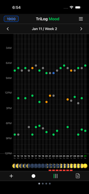
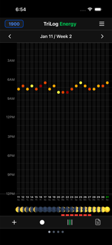
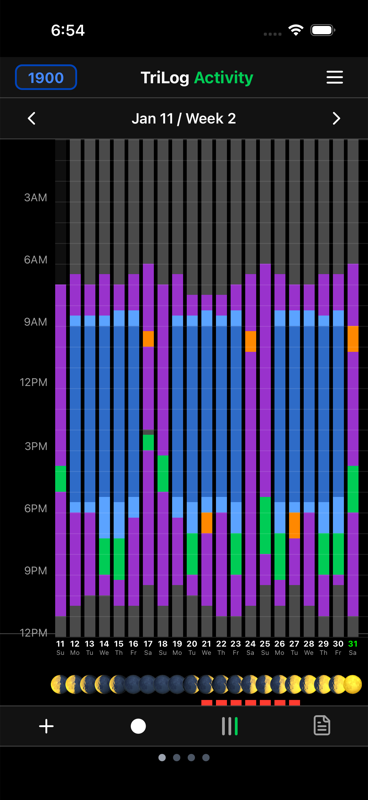
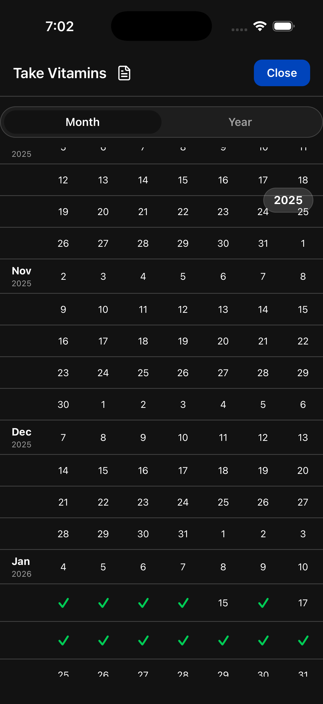

# Single Metric View

The main chart normally shows all three signals—mood, energy, and activity—for one week. But you can also view a single metric across three weeks.

## Why Single Metric View?

When you focus on one metric:

- **See three weeks at once** instead of one
- **Spot longer patterns** that span multiple weeks
- **Reduce visual clutter** when you want to focus

This is especially useful for noticing weekly rhythms and multi-week trends.

## Switching to Single Metric View

Tap the metric name in the chart header to cycle through views:

- **All** → Shows mood, energy, and activity (1 week)
- **Mood** → Shows only mood (3 weeks)
- **Energy** → Shows only energy (3 weeks)
- **Activity** → Shows only activity (3 weeks)

Keep tapping to cycle back to the full view.

## Mood Only

Shows your mood entries across three weeks. Each column is a day, with mood indicators visible without the activity blocks.

This view helps you see:
- Which days tend to be better or worse
- Weekly mood patterns (Monday blues, weekend lifts)
- How mood changes over a three-week span

## Energy Only

Shows your energy levels across three weeks.

This view reveals:
- Your natural energy rhythms
- Which days you're typically depleted
- How energy fluctuates week to week

## Activity Only

Shows your activities across three weeks. The familiar colored blocks, but spanning more time.

This view shows:
- How you spend your time across weeks
- Whether your schedule is consistent or varied
- Patterns in sleep, work, exercise timing

## Extended Views

For even longer perspectives, some metrics support year-long views in the Metrics grid.

Tap a row header in the Metrics grid to see that metric across an extended time period.

## When to Use Single Metric View

**Reviewing mood patterns**: Switch to mood-only when you want to see how your emotional state changes over weeks.

**Checking energy trends**: Use energy-only to spot fatigue patterns or see if changes (better sleep, more exercise) are helping.

**Analyzing time use**: Activity-only shows whether you're maintaining balance or if work is crowding out other activities.

**Reducing overwhelm**: Sometimes the full chart is too dense. Single metric view simplifies without losing data.

---

[← Back to Guide](index.md) · [Next: Notes →](notes.md)
