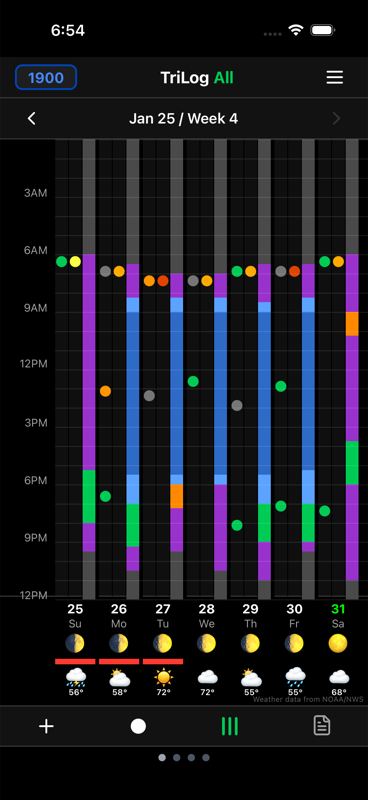
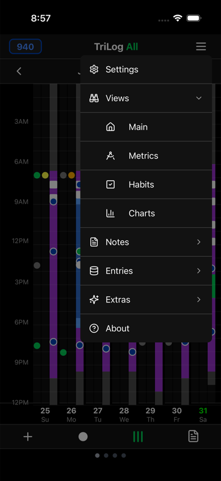

# The Visual Grid

The main screen is TriLog's signature feature: an entire week displayed on a single screen. Here's how to read it.

## Anatomy of the Grid

### Columns = Days

Each column represents one day, Sunday through Saturday. The current day is highlighted.

### Rows = Hours

Each row represents one hour, from midnight at top to 11pm at bottom. This creates a 7×24 grid showing 168 hours of your life.

### Colored Blocks = Activities

Activities appear as colored blocks filling the cells. Each activity has its own color:

- **Blue** — Sleep
- **Orange** — Work
- **Green** — Exercise
- **Purple** — Leisure
- **Yellow** — Socialize
- **Gray** — Transit
- And so on...

The height of a block shows duration. A 2-hour work session fills 2 cells.

### Small Indicators = Mood & Energy

Small colored dots or icons show mood entries. Look for them at the edges of activity blocks.

## Navigation

**Swipe left** to see previous weeks.
**Swipe right** to return to recent weeks.

The header shows the date range for the current view.

## Weather Strip

Below the grid, a row of weather icons shows the weather for each day. This helps you notice correlations between weather and mood.

Toggle weather display in Settings → Appearance.

## Moon Phases

Moon phase indicators appear alongside the weather. Some people notice patterns with lunar cycles—especially around sleep.

Toggle moon phases in Settings → Appearance.

## Light Mode

TriLog works in both dark and light modes. The app respects your system preference, or you can set it manually in Settings.

## Interacting with the Grid

**Tap any cell** to view entries for that hour. A detail view shows what was logged.

**Tap the + button** to add a new entry for the current time.

**Long-press a cell** (in some views) to access quick actions.

## Other Views

Swipe right from the main grid to access additional views:

- **Metrics Grid** — Daily measurements in rows
- **Habits** — Daily habit completions
- **Charts** — Activity distribution and trends

Small dots at the bottom indicate which view you're on. Swipe between them or tap a dot to jump directly.

## Why This Design?

Most apps show one day at a time. You see today, maybe scroll to yesterday, but rarely review a full week together.

The grid view is intentionally dense. When 168 hours are visible at once:

- **Patterns emerge.** That Wednesday afternoon slump becomes obvious.
- **Correlations appear.** Exercise preceding better evenings shows up.
- **Gaps stand out.** Missing data is visible, prompting you to fill it.

The goal isn't to analyze every cell. It's to let your eye catch patterns that sequential views would hide.

## Single Metric View

Want to see more time at once? You can view a single metric (mood, energy, or activity) across three weeks instead of all metrics for one week.

Tap the metric name in the header to switch views. See [Single Metric View](single-metric-view.md) for details.

---

[← Back to Guide](index.md) · [Next: Single Metric View →](single-metric-view.md)
