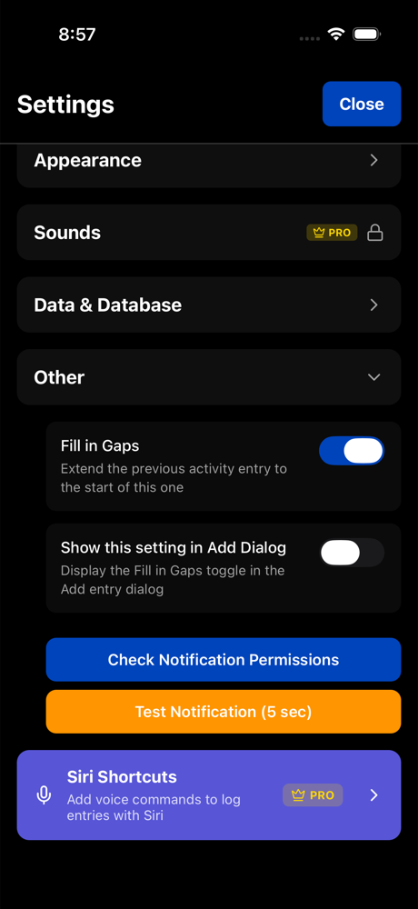

# Tracking Basics

TriLog captures three signals: mood, energy, and activity. Each tells a different part of your story.

## Mood

Mood reflects your emotional state. TriLog offers five options:

- **Happy** — Positive, content, joyful
- **Neutral** — Neither good nor bad, baseline
- **Sad** — Down, low, melancholy
- **Anxious** — Worried, stressed, uneasy
- **Upset** — Frustrated, angry, irritated

These categories are deliberately broad. They're not meant to capture every nuance of human emotion—they're meant to show patterns over time.

**Don't overthink it.** Your first instinct is usually correct. If you're torn between two options, either will do. Precision matters less than consistency.

## Energy

Energy is your sense of physical and mental vitality. Five levels, from depleted to charged:

1. **Very Low** — Exhausted, depleted, running on empty
2. **Low** — Tired, sluggish, dragging
3. **Moderate** — Neither tired nor energized
4. **High** — Alert, capable, functioning well
5. **Very High** — Energized, sharp, fully charged

Energy is separate from mood. You can be happy but exhausted after a great party. You can be energized but anxious before a presentation. Tracking both reveals interesting patterns.

## Activity

Activity records what you're doing. Categories include:

- **Sleep** — Sleeping, napping
- **Work** — Professional work, job tasks
- **School** — Classes, studying, homework
- **Exercise** — Workouts, sports, physical activity
- **Leisure** — Relaxation, hobbies, entertainment
- **Socialize** — Time with friends, family, social events
- **Transit** — Commuting, traveling
- **Morning Routine** — Morning activities and preparation
- **Recovery** — Rest, recuperation
- **Other** — Anything else

When you switch activities, log the new one. The previous activity extends until the new entry.

## The Fill Gaps Option

When enabled, **Fill Gaps** automatically extends your previous activity to cover unlogged time.

For example: You log "Work" at 9am. At noon, you log "Lunch." Fill Gaps automatically fills 9am-12pm with Work.

This creates continuous tracking without constant logging. Enable it in the add entry screen.

## Backdating Entries

Forgot to log earlier? Tap the time display in the add entry screen to change when your entry was recorded. Useful for:

- Filling in a morning you missed
- Correcting a mistimed entry
- Logging sleep after waking up

## Tips for Consistent Tracking

**Start simple.** Just mood and activity for the first week. Add energy once you're comfortable.

**Don't aim for perfection.** Missing entries is fine. Rough estimates are fine. The goal is trend visibility, not precision.

**Trust your first instinct.** Deliberating between "3" and "4" energy wastes time. Pick one and move on.

**Log even on normal days.** Boring, average days establish your baseline. They're as valuable as dramatic ones.

---

[← Back to Guide](index.md) · [Next: The Visual Grid →](the-grid.md)
