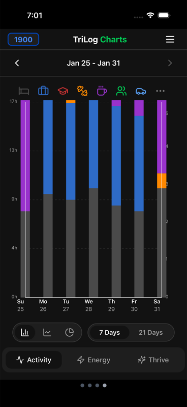
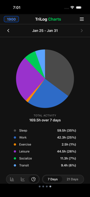
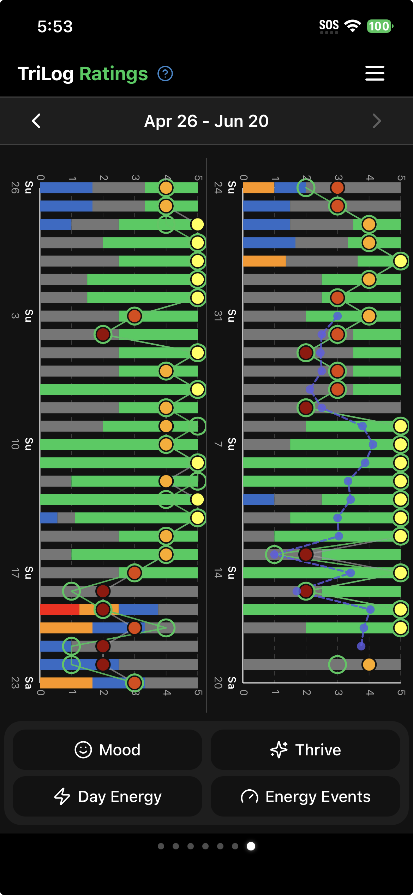
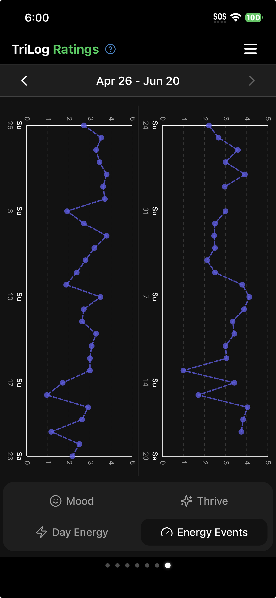

# Viewing Patterns

TriLog offers multiple ways to review your data. Each view shows different patterns.

## The Metrics Grid

Swipe right from the main chart to reach the Metrics view. This grid shows daily measurements in rows:

### What You See

Each row is a different metric:
- **Mood** — Colored bar showing your mood
- **Energy** — Numeric energy level
- **Sleep** — Hours of sleep
- **Steps** — Daily step count (if enabled)
- **Calories** — Daily calorie intake (if tracking meals)
- **Custom Trackers** — Any trackers you've created

Each column is a day of the week. You see seven days at once.

### Customizing the Grid

Tap the settings icon to choose which rows appear:

Hide metrics you don't track. Show the ones you care about.

### Viewing Details

Tap any row header to see that metric in more detail—a focused view showing just that measurement over time.

---

## Charts View

Swipe further right to reach Charts. This view shows how you spend your time.

### Activity Distribution

See how your time divides across activities:
- Hours of sleep
- Hours of work
- Exercise time
- Leisure time
- And so on

The chart updates as you navigate between weeks.

### Chart Modes

Toggle between different visualizations:

**Bar Chart** — Activities as stacked or grouped bars
**Pie Chart** — Activities as pie slices showing proportions

### Time Periods

Switch between:
- **7 days** — One week
- **21 days** — Three weeks

Longer periods show broader patterns; shorter periods show recent detail.

---

## Ratings Charts

Swipe past Charts to reach Ratings Charts. This view shows your daily subjective ratings — Mood, Energy, Thrive, and a calculated Energy Events score — as two side-by-side line charts, each covering four weeks (28 days, Sunday to Saturday).

### What You See

Two vertical landscape charts:

- **Left chart** — the older four-week period
- **Right chart** — the more recent four-week period

Each chart has a 0–5 y-axis on both sides, with day labels along the bottom.

### Four Toggles

The bottom bar has two rows of toggles:

**Row 1:**
- **Mood** — Stacked vertical bars per day, proportional to your mood distribution (upset, anxious, sad, neutral, happy). Each bar fills the full chart height so you can see the mood mix at a glance.
- **Thrive** — Your daily "on" rating (1–5) — how present or aligned you felt. Shown as open green rings connected by a green line.

**Row 2:**
- **Day Energy** — The 1–5 energy rating you enter as a daily summary. Colored dots connected by a gray line, from dark red (1) to bright yellow (5).
- **Energy Events** — A calculated weighted energy score that combines your individual energy entries with sleep activity throughout the day. Sleep hours count as 0. Waking hours use the most recent energy level (last observation carried forward). Hours before your first energy entry borrow that first level. The score is the average of all 24 hourly values, so it reflects both energy intensity and sleep duration.

### Tooltips

Tap anywhere on a chart to select the nearest day. A tooltip appears showing the date, Energy, Thrive, and Energy Events score. Tap "View Notes" to jump to the Notes by Day modal for that date. Tap the tooltip or the same day again to dismiss it.

### Navigation

Use the arrows at the top to move back and forward by four weeks. The date range label shows the full eight-week span covered by both charts.

Enable in **Settings → Appearance → Ratings Charts View** (on by default).

---

## Entry History

### Mood Entries List

From the Menu, access "Mood Entries" to see a chronological list of all your mood, energy, and activity entries.

Each entry shows:
- Timestamp
- Mood
- Energy level
- Activity
- Any associated notes

Swipe left on an entry to edit or delete it.

### Day End Entries

"Day End Entries" (from the Menu) shows your daily reflections—journal entries, goals, and wellness ratings.

This is useful for reviewing what you wrote, not just what you logged.

---

## What Patterns Look Like

After a few weeks of tracking, patterns become visible:

### Energy Rhythms
You might notice your energy consistently dips after lunch, or that weekends have different energy profiles than weekdays.

### Mood Correlations
Exercise might precede better moods. Poor sleep might precede worse ones. Social time might correlate with happiness.

### Activity Balance
The charts reveal how you actually spend time versus how you think you spend it. Many people are surprised by the numbers.

### Cyclical Patterns
Some patterns are weekly (Monday blues, Friday energy). Some are monthly. Some are seasonal. The longer you track, the more cycles become visible.

---

## Tips for Pattern Recognition

**Look at weeks, not days.** Single days are noisy. Weeks show trends.

**Compare similar periods.** Compare this week to last week. This month to last month.

**Notice surprises.** When something doesn't match your expectations, pay attention.

**Don't force conclusions.** Correlation isn't causation. Notice patterns, but hold conclusions loosely.

---

[← Back to Guide](index.md) · [Next: Habits →](habits.md)
